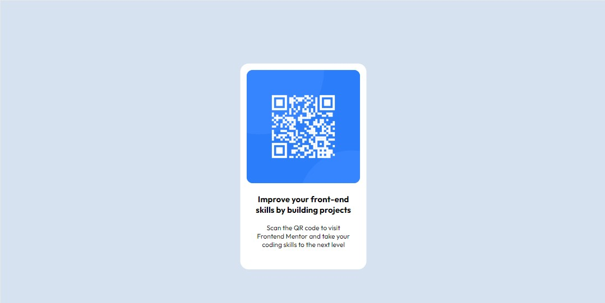
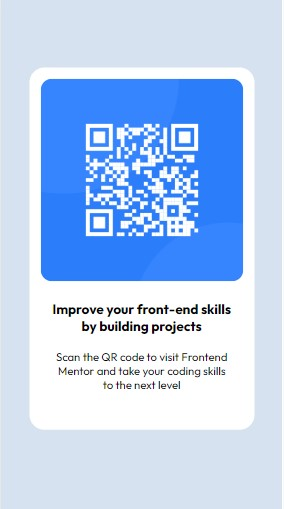

# Frontend Mentor - solución de componentes de código QR

Esta es una solución a [QR code component challenge on Frontend Mentor](https://www.frontendmentor.io/challenges/qr-code-component-iux_sIO_H). Frontend Mentor me ayuda a mantener frescos los conocimientos sobre frontend. En este caso una pequeña práctica de HTML y CSS.

## Tabla de contenido

- [Descripción general](#overview)
  - [Captura de pantalla](#screenshot)
  - [Enlaces](#links)
- [Mi proceso](#my-process)
  - [Construido con](#built-with)
  - [Que aprendí de nuevo](#what-i-learned)
  - [Continued development](#continued-development)
  - [Useful resources](#useful-resources)
- [Autora](#author)

## Descripción general

### Screenshot

### Links

- URL de la solucion: [CHALLENGE-QR-code-component](https://github.com/Ivatroth/CHALLENGE-QR-code-component.git)

## Mi proceso

### Construido con

- HTML5
- CSS custom properties
- Flujo de trabajo: Mobile-first

### Que Aprendi de nuevo

Esta práctica me sirvió para reforzar conceptos y prácticas de HTML y CSS. Me ayudó a comprender un poco más los custom properties.

### Desarrollo continuo

Mi objetivo es fijar mucho más los conceptos básicos de la programación web, de tal manera que mi codificación en lo más básico sea intuitiva y rápida. Esto es solo el comienzo.

## Author

- Website - [Ivana Frontroth]https://ivanafrontroth-portfolio.vercel.app/)
- Frontend Mentor - [@ivatroth](https://www.frontendmentor.io/profile/Ivatroth)
- LinkedIn - [https://www.linkedin.com/in/ivana-frontroth/](https://www.linkedin.com/in/ivana-frontroth/)

